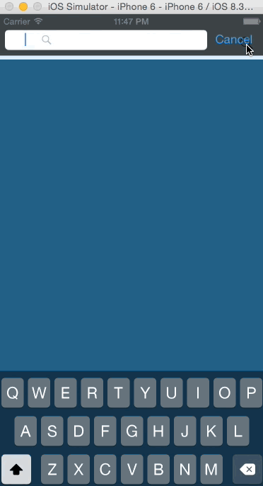

# SampleSwiftSuggestView

iOSでSuggestを表示してみました。

記事はこちらからどうぞ

[【Swift】iOSでSuggestキーワードを表示してみた](http://qiita.com/ryokosuge/items/8e7e1b7df9240b5e8663)

## GIF



## 遊び方

`rbenv`, `bundler`がインストールされていること前提とします。

```sh
# cocoapodsのインストール
$ bundle install --path=vendor/bundle --binstubs=vendor/bin
# pod install
$ bundle exec pod install
# open
$ open SampleSuggest.xcworkspace
```

で遊べるかと思います。

## Suggest API

ここにお世話になりました。

[http://logic.moo.jp/data/archives/792.html](http://logic.moo.jp/data/archives/792.html)
